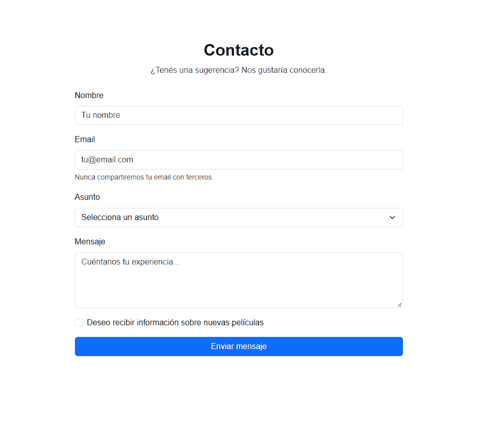
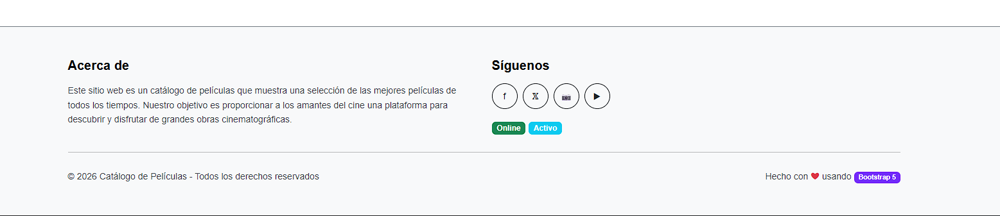

# Catálogo de Películas

Este proyecto consiste en completar un catálogo de películas con una interfaz visual realizada con HTML, CSS y Bootstrap.

## Objetivo

Debes terminar la página del catálogo de películas agregando la sección de contacto con un formulario y completando el footer de la página.


1. Crear la sección de contacto dentro del sitio.
2. Agregar un formulario con los siguientes campos:
   - Nombre
   - Email
   - Asunto
   - Mensaje
   - Checkbox para recibir novedades

## Sección de contacto

La sección debe quedar como parte del catálogo y debe incluir el siguiente contenido:
```HTML
<section id="contacto">
  <div>
    <h2 class="fw-bold">Contacto</h2>
    <p class="text-muted">¿Tenés una sugerencia? Nos gustaría conocerla.</p>
  </div>

  <form class="w-50 mx-auto">
    <button type="submit">
      Enviar mensaje
    </button>
  </form>
</section>
```




## Footer

El footer debe contener una estructura similar a esta:




